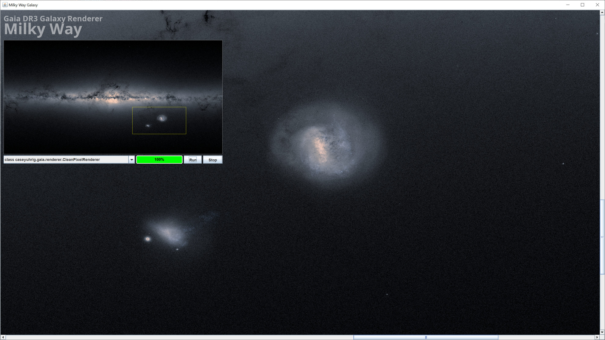

# Gaia DR3 Galaxy Renderer

Java Swing program that renders a portion of the Milky Way Galaxy using the data from the Gaia DR3 catalog.

There are a couple files taken from the https://bsrender.io/ project's C source code and converted to Java.

### Notes and Links

[Color Functions](https://www.mathworks.com/help/images/referencelist.html?type=function&category=color&s_tid=CRUX_topnav)
